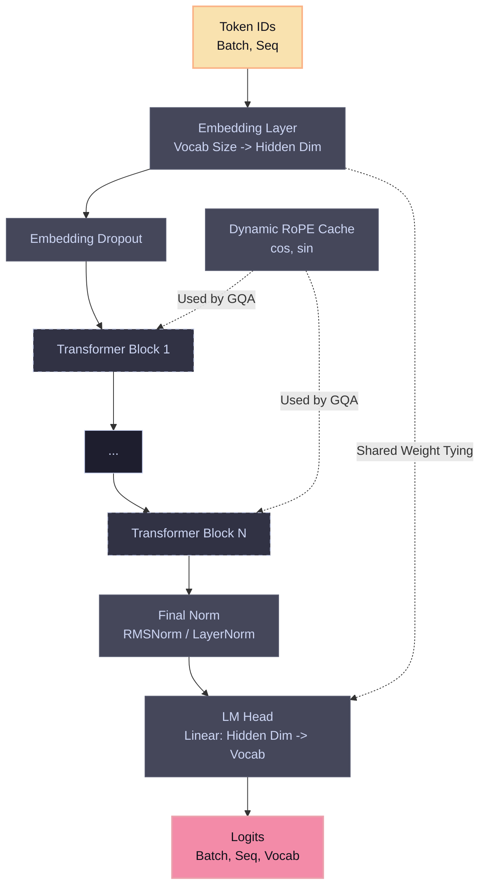
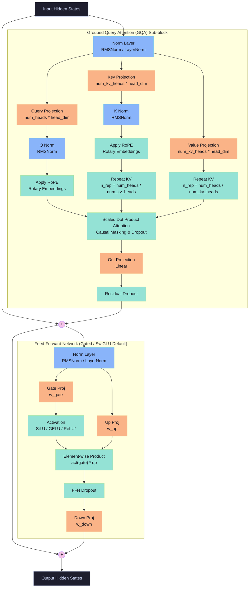

# Nova: Modern Transformer from Scratch (~141M parameters)

A complete, self-contained implementation of a modern transformer language model built from scratch using PyTorch. Nova features:
* **RMSNorm** and **LayerNorm** (implemented from scratch)
* **SwiGLU**, **GELU**, and **ReLU²** feedforward activations (implemented from scratch)
* **Rotary Position Embeddings (RoPE)** (implemented from scratch)
* **Grouped Query Attention (GQA)** with optional **QK-Normalization** and attention entropy tracking
* Tied word embeddings (shared weights between embeddings and language model head)
* Custom callback-driven training loop supporting automatic mixed precision (AMP) and DataParallel multi-GPU scaling
* Custom metric visualizer compiling a 2×2 dashboard of metrics at the end of training

---

## 📊 Model Architecture Diagram

This repository implements the **Nova** architecture, a modern decoder-only transformer. Below are the visual diagrams of the global architecture pipeline and the inner details of each Transformer block.

### 1. Global Model Pipeline



### 2. Transformer Block Internals (Pre-Norm)



---

## 🤗 Hugging Face Model

The trained weights and model card for **Nova 141M** are published on Hugging Face:  
👉 **[sarimahsan/nova-141m-tinystories](https://huggingface.co/sarimahsan/nova-141m-tinystories)**


## 📂 Project Structure

```
.
├── components/
│   ├── activations.py      # SiLU (for SwiGLU), GELU, ReLU²
│   ├── attention.py        # GQA with QK-norm + RoPE
│   ├── block.py            # Pre-norm transformer block
│   ├── feedforward.py      # SwiGLU FFN
│   ├── norms.py            # RMSNorm, LayerNorm (from scratch)
│   └── rope.py             # Rotary Position Embeddings
├── models/
│   └── transformer.py      # Full causal LM
├── trainer/
│   ├── trainer.py          # Causal language model training loop
│   └── callbacks.py        # Logger, Checkpoint, EarlyStopping, Plotter
├── utils/
│   ├── data.py             # HF dataset loading + tokenization
│   ├── seed.py             # Reproducibility
│   └── config.py           # Dataclass-based config
├── tests/
│   ├── test_environment.py # Smoke tests for packages and hardware
│   └── test_model.py       # Comprehensive unit tests for model layers
├── configs/
│   └── default.yaml        # ~141M parameter model default configuration
├── train.py                # Single training entrypoint
└── requirements.txt        # Package dependencies
```

---

## 🛠️ Installation

```bash
# Clone the repository
git clone https://github.com/sarimahsan/nova.git
cd nova

# Install dependencies
pip install -r requirements.txt
```

---

## 🧪 Verification & Unit Testing

Always run tests to verify that your current hardware, versions, and layers are functioning correctly:

```bash
# 1. Run environment and library version smoke checks
python -m pytest tests/test_environment.py -v

# 2. Run model architecture and training process tests
python -m pytest tests/test_model.py -v

# 3. Run a quick local CPU pipeline test (takes ~30 seconds)
python train.py --config configs/default.yaml --output_dir test_output --quick_test
```

---

## 🚀 Training on Kaggle (2×T4 GPUs)

Under Kaggle notebook environment with **2×T4 GPUs** accelerator option enabled, execute the following commands in a code cell:

```bash
# 1. Clone repository
!git clone https://github.com/sarimahsan/nova.git
%cd nova

# 2. Install requirements
!pip install -r requirements.txt

# 3. Verify environment is configured correctly
!python -m pytest tests/test_environment.py -v
!python -m pytest tests/test_model.py -v

# 4. Start training on 2×T4 GPUs (DataParallel + bf16 autocast)
!python train.py --config configs/default.yaml --output_dir /kaggle/working/results
```